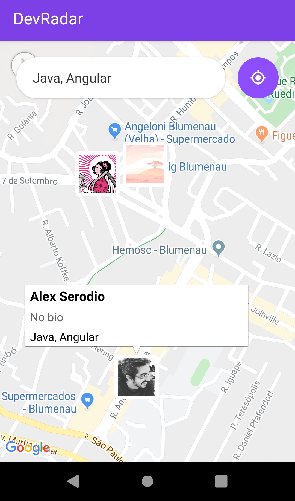
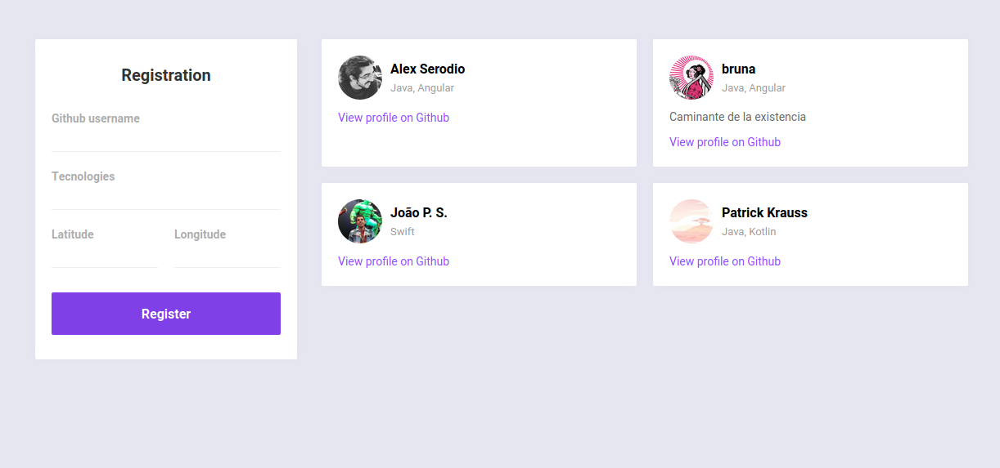

# Dev Radar

A web and mobile application developed using **Node**, **MongoDB**, **React** and **React-Native**, to register and search for pre-registered developers using theirs github profile as reference. The project was created during a course from [Rocketseat](https://rocketseat.com.br/) called **Semana Omnistack 10.0**.

<p align="center">
  
  
</p>

## Requirements

* [Node](https://nodejs.org/en/)
* [Expo CLI](https://expo.io/tools#cli)
* [MongoDB Atlas](https://www.mongodb.com/cloud/atlas) account
* [Expo app](https://play.google.com/store/apps/details?id=host.exp.exponent) installed on a smartphone for mobile app preview
* [MongoDB Compass](https://www.mongodb.com/download-center/compass) to manage the database (optional)


## Getting Started
The project is divided in three folders: backend, web and mobile. 

### Backend
An API developed with node, express and MongoDB, making available the following resources:
* **GET /devs** - get all developers registered sorted by name
* **POST /devs** - add new developer
* **GET /search** - get developers within a radius of 10 kilometers who are registered with the technologies informed, sorted by name
* **PUT /devs** - update an existing developer
* **DELETE /devs** - remove an existing developer

All devs must be registered with their GitHub username, so that their name, picture and bio can be recovered using the [GitHub API](https://developer.github.com/v3/).

### Web
Allows the user to register a new dev in the application, in addition to listing all previously registered devs. 

The dev's registration form requires informing the name, github user, list of known technologies and the person's latitude and longitude. Because of this, when opening the application for the first time, access to geolocation will be requested. If permission is granted, the latitude and longitude fields will be filled in automatically, otherwise they can be filled in manually.


### Mobile
Allows the user to search for devs that work with the technologies informed in the search bar within a radius of 10 kilometers, showing the location of each one on the map. It also allows you to view each user's Github profile by clicking on their names.

## Running the applications
### Backend
```
cd backend
npm install
node src/index.js
```

### Web
```
cd web
npm install
npm start
```

### Mobile
```
cd web
npm install
npm start
```

## Acknowledgments
This project was developed for study purposes following a workshop called **Semana Omnistack 10.0** from [Rocketseat](https://rocketseat.com.br/) and has no intention of being used commercially.
